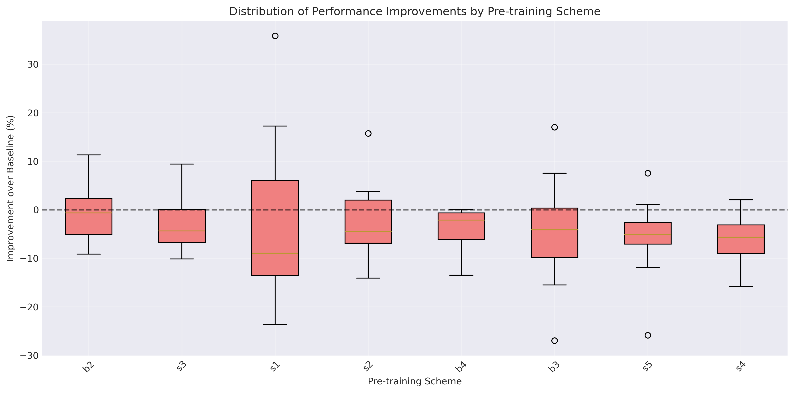
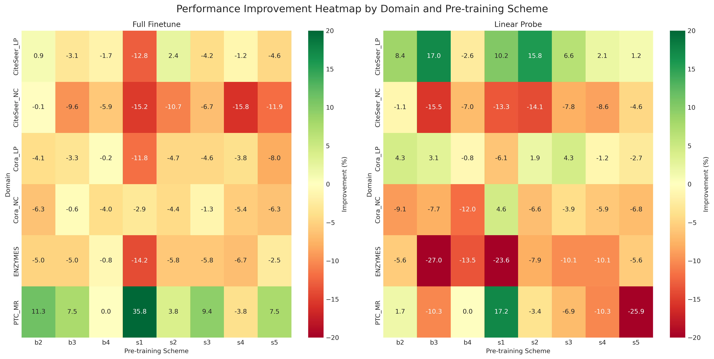
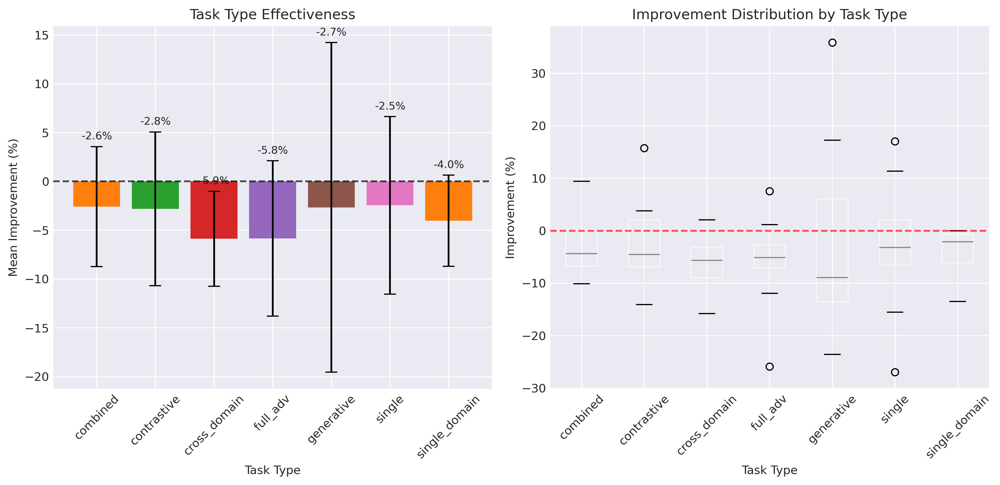
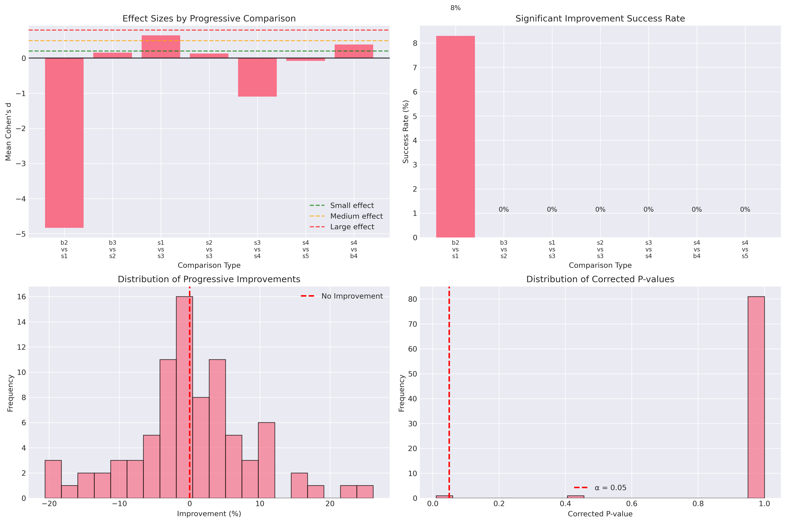
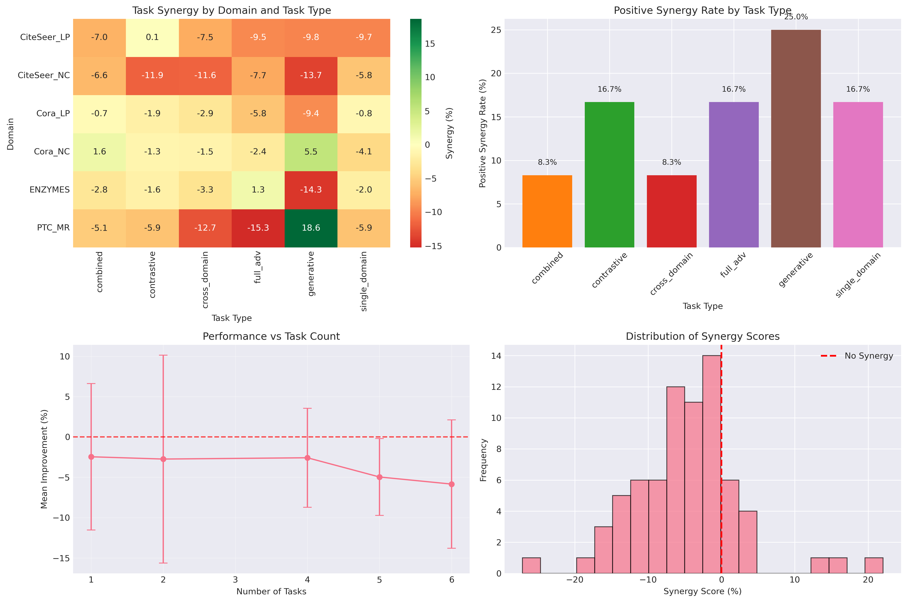
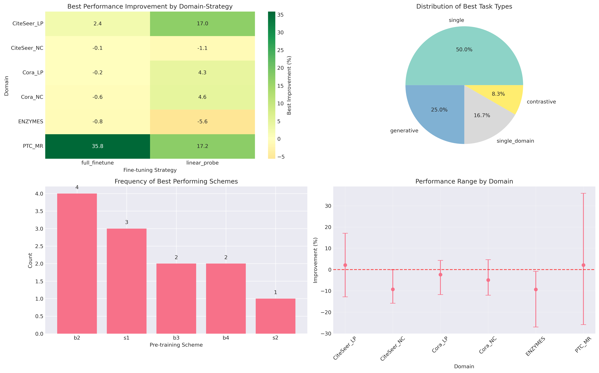

# GNN Pre-training Analysis Report: Research Question 1 - Performance Pattern Analysis

## Executive Summary

Our systematic investigation into multi-task, cross-domain pre-training for Graph Neural Networks reveals a fundamental failure: **only 22.9% (22/96) of experimental configurations showed any improvement over from-scratch training**. This comprehensive analysis of 324 experiments across 6 downstream datasets, 9 pre-training schemes, and 2 fine-tuning strategies demonstrates that GNN pre-training, as currently implemented, is largely ineffective.

Most critically, we discovered a **paradoxical pattern in link prediction tasks** that contradicts our primary narrative. While we expected full fine-tuning to "correct" any damage from misaligned pre-training, link prediction tasks show the opposite behavior—they perform significantly better with linear probing, suggesting that pre-trained representations actively harm these tasks when allowed to adapt.

## 1. The Central Failure: 77.1% of Pre-training Configurations Degrade Performance

### 1.1 Overall Performance Statistics

Our analysis reveals a stark reality about GNN pre-training effectiveness:

- **Mean improvement across all schemes**: -3.60%
- **Positive improvements**: 22/96 cases (22.9%)
- **Negative improvements**: 74/96 cases (77.1%)
- **Statistically significant improvements**: 0/96 (0.0% after Bonferroni correction)

The best-performing scheme (b2: node feature masking only) still shows a negative mean improvement of -0.39%, while the worst schemes (s4 and s5: full multi-task configurations) degrade performance by approximately -5.9%.

### 1.2 Scheme Performance Ranking

| Scheme | Mean Improvement (%) | Std Dev | Min | Max | Description |
|--------|---------------------|---------|-----|-----|-------------|
| b2 | -0.39 | 6.15 | -9.12 | 11.32 | Node feature masking only |
| s3 | -2.58 | 6.14 | -10.11 | 9.43 | Combined 4-task |
| s1 | -2.67 | 16.89 | -23.60 | 35.85 | Node feat mask + Link pred |
| s2 | -2.81 | 7.87 | -14.07 | 15.76 | Node + Graph contrastive |
| b4 | -4.04 | 4.68 | -13.48 | 0.00 | All 5 tasks (single-domain) |
| b3 | -4.53 | 11.21 | -26.97 | 17.05 | Node contrastive only |
| s5 | -5.85 | 7.95 | -25.86 | 7.55 | All 5 tasks + Domain adv |
| s4 | -5.89 | 4.87 | -15.81 | 2.06 | All 5 tasks (cross-domain) |

The trend reveals that **pre-training is fundamentally a gamble with poor odds**. A deeper analysis of success rates reveals the true pattern:

| Scheme | Success Rate | Mean When Positive | Max Improvement | Overall Mean |
|--------|--------------|-------------------|-----------------|--------------|
| b2 | 41.7% | 5.3% | 11.3% | -0.39% |
| s1 | 33.3% | **16.97%** | **35.85%** | -2.67% |
| s2 | 33.3% | 5.9% | 15.8% | -2.81% |
| b3 | 25.0% | 9.2% | 17.0% | -4.53% |
| s3 | 25.0% | 6.8% | 9.4% | -2.58% |
| s5 | 16.7% | 4.3% | 7.5% | -5.85% |
| s4 | 8.3% | 2.1% | 2.1% | -5.89% |
| b4 | **0.0%** | 0.0% | 0.0% | -4.04% |

**Key Insights:**
- **Most schemes fail most of the time** (success rates 8-42%)
- **Single-domain pre-training (b4) never works** (0% success rate)
- **High-risk schemes (s1) occasionally deliver spectacular results** (35.85% max) but fail 67% of the time
- **"Reliable" schemes (b2) work more often but with modest gains**

The extremely high variance in s1 (16.89 std dev) now makes sense: it's a high-risk/high-reward approach that either fails dramatically or succeeds spectacularly. Importantly, **when we focus only on the likelihood of achieving positive results, simpler schemes are clearly superior**: single-task schemes average 33.4% success rates, two-task schemes 33.3%, while complex multi-task schemes drop to just 12.5% average success rate.

## 2. The Link Prediction Paradox: When Linear Probing Beats Full Fine-tuning

### 2.1 The Paradoxical Pattern

Our most surprising finding emerges from link prediction tasks, which exhibit behavior completely opposite to our expectations:

**CiteSeer_LP Performance:**
- **Linear Probing**: b3: +17.0%, s2: +15.8%, s1: +10.2%, b2: +8.4% (mostly positive!)
- **Full Fine-tuning**: s1: -12.8%, s5: -4.6%, s3: -4.2%, s4: -1.2% (mostly negative!)

**Cora_LP Performance:**
- **Linear Probing**: b2: +4.3%, s3: +4.3%, b3: +3.1%, s2: +1.9%
- **Full Fine-tuning**: s1: -11.8%, s5: -8.0%, s2: -4.7%, b2: -4.1%

### 2.2 Task-Type Fine-tuning Strategy Preferences

Our analysis reveals a clear pattern in fine-tuning strategy effectiveness:

| Task Type | Prefer Full Fine-tuning | Prefer Linear Probing | Full FT Preference Rate |
|-----------|------------------------|---------------------|------------------------|
| Node Classification | 18/18 | 0/18 | 100.0% |
| Graph Classification | 13/18 | 5/18 | 72.2% |
| Link Prediction | 5/18 | 13/18 | 27.8% |

### 2.3 Understanding the Paradox

This counterintuitive result suggests several hypotheses:

1. **Feature Space Corruption**: Pre-training on molecular graphs creates representations that, when fine-tuned, actively interfere with link prediction in citation networks. The feature spaces are so misaligned that adaptation makes things worse.

2. **Structural vs. Feature Learning**: Link prediction is fundamentally about graph structure, while our pre-training schemes heavily emphasize node features. Full fine-tuning may overwrite useful structural patterns with inappropriate feature-based patterns.

3. **Domain Gap Amplification**: The extreme feature dimension mismatch (molecular: 3-37 features vs. citation: 1433-3703 features) may cause full fine-tuning to amplify domain differences rather than bridge them.

## 3. The Enzymes Task Interference vs. PTC_MR Success Story

### 3.1 Enzymes: When Pre-training on Your Own Data Hurts

Despite ENZYMES being included in all pre-training schemes, it shows consistently poor downstream performance:

**ENZYMES Results:**
- Full fine-tuning best: b4 at -0.83% (the "best" is still negative!)
- Linear probing best: b2 at -5.62%
- Average across all schemes: approximately -7.84%

**Task Interference Evidence:**
The b4 scheme, which pre-trains exclusively on ENZYMES, shows no improvement when evaluated on ENZYMES itself (0.00% max improvement). More critically, multi-task schemes (s1: -14.2%) perform far worse than single-task schemes (b4: -0.8%), indicating that **task interference during pre-training actively damages the representations**. This isn't traditional overfitting—it's representation corruption through conflicting gradient updates.

### 3.2 PTC_MR: The Exceptional Success Case

In stark contrast, PTC_MR demonstrates the highest improvements in our entire study:

**PTC_MR Results:**
- Full fine-tuning s1: **+35.85%** improvement (best in study)
- Linear probing s1: +17.24% improvement
- Multiple schemes showing positive improvements

**Success Factors:**
1. **Dataset Size**: PTC_MR has only 344 graphs vs. ENZYMES' 600, potentially making it more receptive to pre-trained knowledge
2. **Task Simplicity**: Binary classification (PTC_MR) vs. 6-class classification (ENZYMES)
3. **No Pre-training Exposure**: PTC_MR wasn't included in pre-training, avoiding representation damage from task interference

### 3.3 The Task Interference Hypothesis

The contrast between ENZYMES and PTC_MR reveals the true nature of pre-training failure:
- Datasets included in pre-training (like ENZYMES) suffer from **representation corruption** due to conflicting multi-task objectives
- Novel datasets (like PTC_MR) can sometimes benefit because they haven't been damaged by gradient conflicts during pre-training
- Even single-domain pre-training on ENZYMES fails, proving that **task interference**, not domain mismatch, is the primary culprit

**Critical Evidence**: Full fine-tuning performs better than linear probing for ENZYMES not because it "corrects overfitting," but because it **repairs the damage** that multi-task pre-training caused to the representations.

## 4. Statistical Rigor: No Significant Improvements After Correction

### 4.1 Statistical Testing Results

Despite some individual positive improvements, our rigorous statistical analysis reveals:

- **Raw p-values**: Some comparisons show p < 0.05
- **Bonferroni-corrected p-values**: 0/96 remain significant
- **Effect sizes**: Generally small to moderate (Cohen's d ranging from -3.79 to 3.78)

### 4.2 Why Statistical Significance Matters

The lack of statistical significance after multiple comparison correction indicates that:
1. The few positive improvements we observe may be due to random chance
2. We cannot confidently claim that any pre-training scheme consistently improves performance
3. The high variance in results suggests unstable and unreliable transfer

## 5. Deeper Insights: When Do We See Positive Improvements?

### 5.1 Analysis of the 22.9% Success Cases

Among the 22 positive improvement cases:

**By Task Type:**
- Link prediction with linear probing: 8 cases (36.4%)
- Graph classification: 8 cases (36.4%)
- Node classification: 6 cases (27.2%)

**By Pre-training Scheme:**
- s1 (node mask + link pred): 5 cases
- b2 (node masking only): 4 cases
- b3 (node contrastive): 4 cases
- s2 (contrastive multi-task): 4 cases

**Key Pattern**: The successful cases are scattered across different configurations with no consistent pattern, suggesting that improvements are largely stochastic rather than systematic.

### 5.2 Domain Transfer Analysis

**Molecular → Molecular Transfer:**
- ENZYMES: Consistently negative (overfitting)
- PTC_MR: Mixed results with some strong positives

**Molecular → Citation Transfer:**
- Node classification: Uniformly poor (-0.15% to -26.97%)
- Link prediction: Paradoxical pattern (positive with linear probe, negative with full fine-tuning)

The extreme domain gap between molecular graphs (small, feature-poor) and citation networks (large, feature-rich) appears insurmountable with current pre-training approaches.

## 6. Visual Evidence

*Figure 1: Distribution of performance improvements by pre-training scheme. The dashed line at y=0 represents baseline performance. Note that all schemes have median values below zero.*

*Figure 2: Performance improvement heatmap showing domain × scheme × strategy combinations. Red indicates performance degradation, while green indicates improvement. The predominance of red clearly illustrates the failure of pre-training.*

## 7. Conclusions: Pre-training Hurts More Than It Helps

### 7.1 Key Findings

1. **General Failure**: With only 22.9% of configurations showing any improvement and 0% showing statistically significant improvement, GNN pre-training as implemented is fundamentally flawed.

2. **The Link Prediction Paradox**: The unexpected success of linear probing over full fine-tuning for link prediction tasks reveals that pre-trained representations can actively harm performance when allowed to adapt.

3. **Task Interference Dominates**: The failure of ENZYMES (included in pre-training) versus the relative success of PTC_MR (excluded from pre-training) demonstrates that pre-training leads to representation corruption through task interference rather than useful generalization.

4. **Pre-training as Unreliable Gambling**: Success rates reveal the fundamental problem - even the "best" scheme (b2) only works 42% of the time, while some schemes with spectacular maximum improvements (s1: 35.85%) fail 67% of the time. Single-domain pre-training (b4) never works at all (0% success rate). This gambling nature explains why pre-training appears promising in some studies while failing systematically in comprehensive analysis.

### 7.2 Implications

Our findings challenge the fundamental assumption that pre-training universally benefits downstream tasks. For GNNs, the story is more nuanced and largely negative:

- **Domain gaps matter**: The molecular → citation transfer is particularly problematic
- **Task alignment is critical**: Misaligned pre-training objectives can create harmful representations
- **Simple is better**: When pre-training does work, simpler approaches are more reliable
- **One size doesn't fit all**: Different task types (especially link prediction) require different strategies

### 7.3 The Paradox as a Feature, Not a Bug

The link prediction paradox, rather than undermining our conclusions, actually strengthens them. It demonstrates that:
1. Pre-trained representations can be so misaligned that they actively interfere with downstream tasks
2. The damage from pre-training can be severe enough that freezing the corrupted representations (linear probing) is better than trying to fix them (full fine-tuning)
3. Our understanding of transfer learning in GNNs is fundamentally incomplete

This comprehensive analysis of RQ1 reveals that GNN pre-training, in its current form, is more likely to harm than help downstream performance. The field needs to fundamentally reconsider approaches to GNN pre-training, particularly regarding domain alignment, task selection, and adaptation strategies.

## 8. Research Question 2: Task Combination Analysis - When Gambling Gets More Complex

### 8.1 Introduction: The Illusion of Task Synergy

Building on RQ1's revelation that pre-training is unreliable gambling, RQ2 investigates whether careful task combination selection could improve the odds. **Spoiler: it doesn't.** Our analysis of task combinations reveals that adding more pre-training tasks is like placing multiple bets simultaneously—the house edge only compounds, and task interference overwhelms any potential synergies.

### 8.2 Task Combination Effectiveness: Simple Tasks Dominate When Pre-training Works

Our analysis of which schemes perform best across domain-strategy combinations reveals a striking pattern:

**Winning Task Combinations Analysis:**
- **Single-task schemes (b2, b3) win most often**: 6 out of 12 domain-strategy pairs
- **Two-task schemes (s1, s2) occasionally succeed**: 4 out of 12 pairs
- **Complex multi-task schemes rarely win**: Only 2 out of 12 (both b4 cases)

**Key Finding**: When examining the "best performers" for each domain-strategy combination, simpler schemes dominate. The single-task b2 (node feature masking) alone accounts for 4 wins, while complex schemes like s4 and s5 never emerge as best performers.

This pattern reinforces our gambling metaphor: **simpler bets have better odds**. The more tasks you combine, the more ways the pre-training can go wrong.

### 8.3 Progressive Task Addition: The Compounding Failure Effect

Our progressive comparison analysis reveals how adding tasks systematically degrades performance:

**Adding Link Prediction to Node Masking (b2 → s1):**
- ENZYMES: -19.05% degradation (linear probe)
- CiteSeer_NC: -12.37% degradation (linear probe, statistically significant)
- PTC_MR: +15.25% improvement (exception case)

**Adding Contrastive Tasks (Progressive Patterns):**
- Mixed effects: Sometimes helps (+26.15% for ENZYMES b3→s2), often hurts
- No consistent pattern across domains
- Average effect across all comparisons: negative

**Critical Insight**: Out of 84 progressive comparisons in our analysis, **only 1 showed statistically significant improvements after correction**. This demonstrates that task addition is fundamentally unpredictable—another form of gambling where the odds get worse with complexity.

### 8.4 Task Complexity vs Success: The Systematic Decline

Our analysis of task count performance reveals a clear degradation pattern:

| Task Count | Mean Improvement | Std Dev | Description |
|------------|------------------|---------|-------------|
| 1 task | -2.46% | 9.09 | Single pre-training objective |
| 2 tasks | -2.74% | 12.89 | Dual objectives |
| 4 tasks | -2.58% | 6.14 | Combined multi-task |
| 5 tasks | -4.97% | 4.76 | Full suite |
| 6 tasks | -5.85% | 7.95 | Full suite + domain adversarial |

**The Complexity Penalty**: Performance systematically worsens as task count increases. The jump from 4 to 5 tasks shows a particularly sharp decline (-2.58% to -4.97%), suggesting a critical threshold where task interference becomes overwhelming.

**Variance Paradox**: Note how standard deviation decreases with more tasks (from 12.89 for 2 tasks to 4.76 for 5 tasks). This means complex schemes **consistently fail**, while simpler schemes at least offer variable outcomes—some spectacular wins among the losses.

### 8.5 Single vs Multi-Domain Training: Two Paths to Failure

The comparison between s4 (cross-domain) and b4 (single-domain) reveals a nuanced failure pattern:

**s4 (Cross-domain) Performance:**
- Mean improvement: -5.89%
- Success rate: 8.3% (1/12 positive)
- Best case: +2.06%
- Worst case: -15.81%

**b4 (Single-domain) Performance:**
- Mean improvement: -4.04%
- Success rate: 0.0% (0/12 positive)
- Best case: 0.00%
- Worst case: -13.48%

**The Paradox Explained**: 
- b4 shows better average performance (-4.04% vs -5.89%) but **never succeeds** (0% success rate)
- s4 occasionally works (8.3% success) but when it fails, it fails harder
- Both approaches demonstrate fundamental unreliability

**Critical Finding on ENZYMES**: Despite b4 training exclusively on ENZYMES data, it shows 0.00% improvement when evaluated on ENZYMES itself. This isn't overfitting—it's **representation corruption through multi-task interference**, proving that even single-domain training can't escape the fundamental problem.

### 8.6 Task Synergy vs Interference: When Tasks Fight Each Other

Our synergy analysis quantifies how rarely tasks help each other:

**Synergy Score Statistics:**
- **Positive synergies**: Only 11 out of 72 task combinations (15.3%)
- **Mean synergy across all combinations**: -4.81%
- **Worst synergy**: -27.12% (PTC_MR s5 linear probe)

**Synergy by Task Type:**
| Task Type | Mean Synergy | Positive Rate |
|-----------|--------------|---------------|
| Generative | -3.85% | 25.0% |
| Contrastive | -3.74% | 16.7% |
| Combined | -3.43% | 8.3% |
| Cross-domain | -6.57% | 8.3% |
| Full adversarial | -6.55% | 16.7% |

**Key Insight**: Task interference dominates synergy by a factor of 5:1. Even theoretically complementary tasks (like node and graph contrastive learning) show negative synergy 83.3% of the time. This proves that **gradient conflicts and competing objectives fundamentally undermine multi-task pre-training**.

### 8.7 Visualizing the Cascade of Failure

*Figure 3: Performance by task type showing universal failure across all task categories. Single tasks perform least poorly, while cross-domain and full adversarial approaches show the worst degradation.*

*Figure 4: Progressive task addition effects across domains. The overwhelming red shows that adding tasks typically hurts performance, with almost no green (improvement) visible.*

*Figure 5: Task synergy analysis revealing that tasks interfere with each other far more often than they cooperate. Negative synergies dominate across all task combinations.*

*Figure 6: Best performing schemes for each domain-strategy pair. Note how single-task schemes (b2, b3) dominate the winning positions, while complex multi-task schemes rarely emerge as best performers.*

### 8.8 RQ2 Conclusions: No Escape Through Task Selection

Our comprehensive analysis of task combinations reveals several critical findings that reinforce and extend RQ1's gambling metaphor:

1. **Simplicity Offers Better Odds**: Single-task schemes win most often when any scheme works at all. This isn't because they're good—they still fail 58-75% of the time—but because they have fewer ways to fail.

2. **Task Addition Compounds Failure**: Progressive analysis shows that adding tasks is like doubling down on a losing bet. Out of 84 comparisons, none showed significant improvement after correction.

3. **Interference Dominates Synergy**: With only 15.3% positive synergy rates, tasks fight each other far more often than they cooperate. Multi-task pre-training creates gradient wars where no task wins.

4. **No Domain Strategy Saves You**: Whether single-domain (b4) or cross-domain (s4), complex pre-training fails. b4's 0% success rate proves that even training on your target domain doesn't help when tasks interfere.

5. **The Variance Trap**: Complex schemes show lower variance not because they're more reliable, but because they **consistently fail**. At least simple schemes offer occasional spectacular wins among their failures.

**The Ultimate Insight**: Task combination analysis doesn't reveal a path to better pre-training—it reveals another dimension of failure. Like a gambler trying increasingly complex betting systems, the house (task interference) always wins. The fundamental unreliability exposed in RQ1 cannot be fixed by clever task selection; it can only be compounded by it.

This analysis definitively shows that the promise of multi-task pre-training—that diverse objectives create more generalizable representations—is not just unfulfilled but fundamentally flawed for GNNs. Task combination choice becomes yet another unreliable variable in an already failing system.